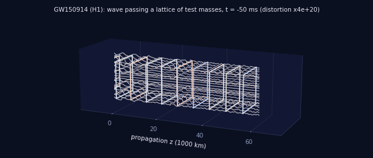
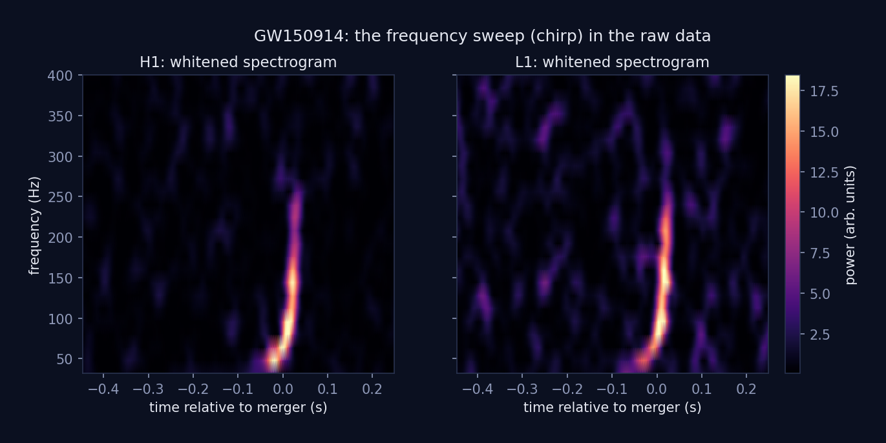
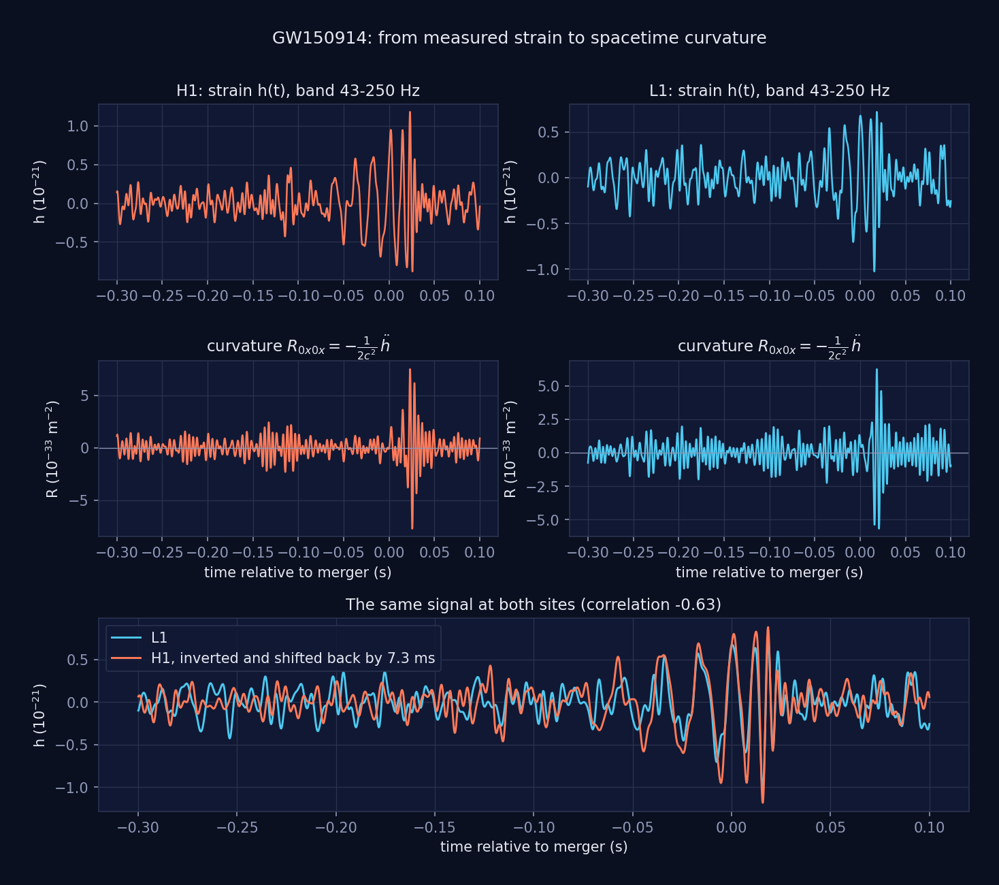
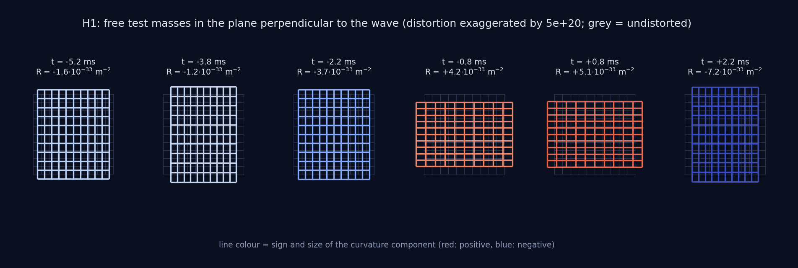
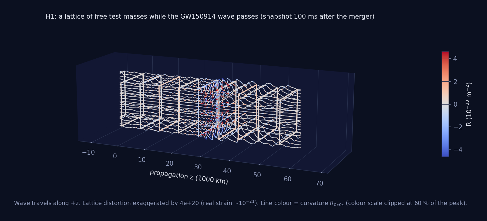
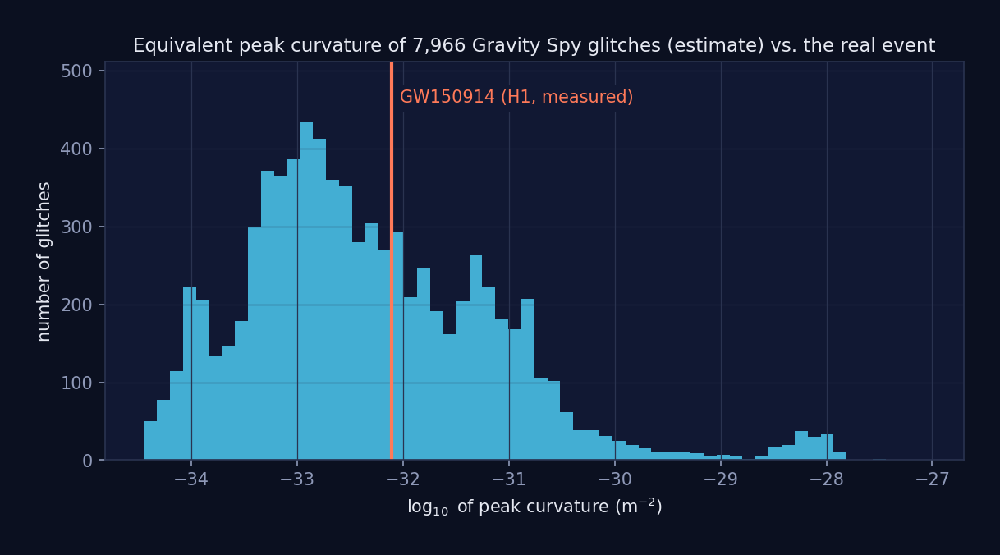

# LIGO Spacetime Curvature

Computes the spacetime curvature of the first detected gravitational wave,
GW150914, directly from the LIGO strain data of both detectors and visualises it
as a distorted grid. A second part analyses the Gravity Spy glitch catalogue
(detector noise transients) and puts the real signal into context.



*A lattice of free test masses while the GW150914 wave passes (H1 data). The
distortion is exaggerated by a factor of about 4e20, because the real strain is
only ~1e-21. Line colour is the curvature component, red positive, blue negative.*

## Results

All numbers come from `python -m ligo_spacetime` (band-pass 43-250 Hz).

| | Hanford (H1) | Livingston (L1) |
|---|---|---|
| peak strain h | 1.18e-21 (8.6 x noise rms) | 1.03e-21 (6.5 x noise rms) |
| peak curvature R | 7.7e-33 m^-2 (9.9 x noise rms) | 6.2e-33 m^-2 (7.6 x noise rms) |
| radius of curvature 1/sqrt(R) | 1.1e16 m (about 1.2 light-years) | 1.3e16 m (about 1.3 light-years) |
| peak time (GPS) | 1126259462.423 | 1126259462.416 |

The two detectors agree with the physics: H1 sees the signal **7.3 ms after L1**
(the light travel time between the sites is about 10 ms, so this is the
maximum possible delay) and **inverted** (correlation -0.63), as expected from
the different orientation of the two detectors.

The peak curvature depends on the chosen band, because a second derivative
weights high frequencies strongly:

| band | peak R, H1 | peak R, L1 |
|---|---|---|
| 43-200 Hz | 4.6e-33 m^-2 | 4.0e-33 m^-2 |
| 43-250 Hz (default) | 7.7e-33 m^-2 | 6.2e-33 m^-2 |
| 43-300 Hz | 9.8e-33 m^-2 | 8.3e-33 m^-2 |

## Figures

**The chirp is really in the data** (whitened spectrogram of the raw strain)



**From strain to curvature** (filtered strain h(t), curvature R(t), and both
detectors overlaid after inverting H1 and shifting it by 7.3 ms)



**Test-mass grid perpendicular to the wave.** A square grid of free masses is
stretched in one direction and compressed in the other. The sign of the
curvature decides which one.



**3D lattice along the propagation direction.**



**Context: glitches.** The curvature of GW150914 compared with an equivalent
estimate for the 7,966 glitches of the Gravity Spy training set. The real event
lies inside the bulk of the glitch distribution, so amplitude or curvature alone
cannot separate a gravitational wave from a glitch. That is why shape-based
classification, as in Gravity Spy, is needed.



## Method

1. **Load** the 32 s strain files (4096 Hz, HDF5) for H1 and L1 and check the
   data-quality flags.
2. **Filter** with a Tukey window, a zero-phase band-pass of 43-250 Hz
   and notches at the mains lines (60, 120, 180, 240 Hz). The lower edge is
   above the calibration lines near 35-37 Hz, which otherwise dominate the band.
3. **Differentiate twice** in the frequency domain. For a plane wave in
   transverse-traceless gauge the tidal part of the Riemann tensor is
   `R_0i0j = -1/2 d^2 h_ij / dt^2` (divided by c^2 for units of 1/m^2). In the
   frame of the detector arms: `R_0x0x = -1/2 h'' / c^2`.
4. **Check** the result: peak time, delay and inversion between the two sites,
   and the signal-to-noise ratio against a pre-event baseline are all tested
   against the real data in `tests/test_real_data.py`.
5. **Visualise** the distortion with the geodesic deviation equation:
   `x' = x (1 + h/2)`, `y' = y (1 - h/2)`.

## Limitations

- A single detector measures one combination of the two polarisations, so only
  the arm-projected component of the curvature is obtained, not the full tensor.
- The curvature is computed from measured, band-limited strain and therefore
  **includes detector noise**. The signal-to-noise ratios are listed above.
  The peak value depends on the band (see the table).
- The wave is treated as a plane wave. The 3D lattice views are exaggerated for
  display and labelled as such.
- The glitch curvature in the context figure is an estimate for a sinusoid with
  the catalogued peak amplitude and frequency. Glitches are instrument noise and
  not real spacetime curvature.

## Quick start

```bash
git clone <repo-url>
cd ligo-spacetime-curvature
pip install -r requirements.txt
python -m ligo_spacetime               # everything, about 25 s
python -m ligo_spacetime gw150914 --no-gif
python -m ligo_spacetime glitches
python -m pytest
```

Figures are written to `figures/`. Options: `--strain-dir`, `--glitch-data`,
`--figures`. The data layout is described in [data/README.md](data/README.md).

## Project layout

```
ligo_spacetime/
    config.py          constants, paths, filter settings
    waves/             strain loading, filtering, curvature, event pipeline
    glitches/          Gravity Spy: loading, features, class profiles
    viz/               figures and animation
    __main__.py        command line interface
tests/                 30 tests: physics checks, synthetic signals, real data
figures/               generated images used in this README
data/                  input data, see data/README.md
```

## Gravity Spy glitch analysis

The `glitches` part profiles the 22 classes of the Gravity Spy training set
(7,966 glitches, 2015-2017): data quality, the strongest events, H1 vs. L1
(H1: 4,798 glitches, most frequent class Blip with 30.3 %; L1: 3,168 glitches,
most frequent class Low_Frequency_Burst with 14.4 %) and a median-based profile of
SNR, duration and peak frequency per class. Medians are used because SNR and
duration are strongly right-skewed. GPS times are converted to UTC including
leap seconds.

## Data and citation

- GW150914 strain data: Gravitational Wave Open Science Center,
  https://gwosc.org/events/GW150914/ (DOI 10.7935/K5MW2F23). Check the terms of
  use and citation guidelines on gwosc.org.
- Detection paper: Abbott et al. (LIGO Scientific Collaboration and Virgo
  Collaboration), *Observation of Gravitational Waves from a Binary Black Hole
  Merger*, Phys. Rev. Lett. 116, 061102 (2016).
- Gravity Spy: Zevin et al. (2017), *Gravity Spy: Integrating Advanced LIGO
  Detector Characterization, Machine Learning, and Citizen Science*,
  Class. Quantum Grav. 34, 064003.

## License

MIT, see [LICENSE](LICENSE). The data sets have their own terms.
